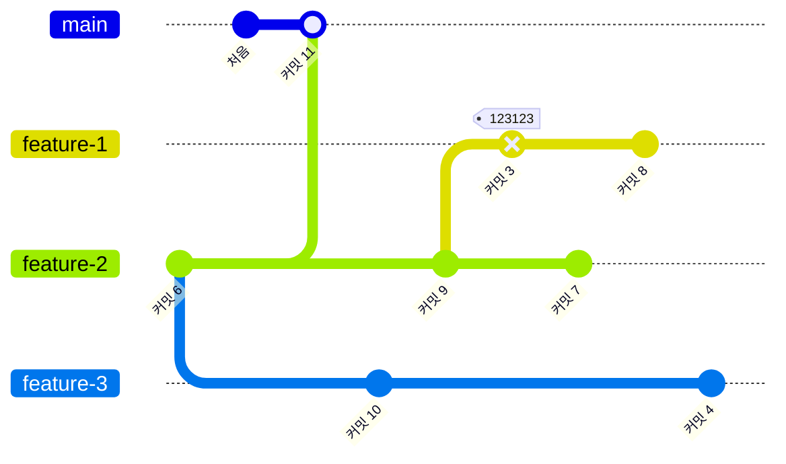

```mermaid
gitGraph
    branch feature-2 order: 2
    commit id: "커밋 6"
    branch feature-3 order: 3
    checkout main
    commit id: "처음"
    merge feature-2 id: "커밋 11"
    checkout feature-3
    commit id: "커밋 10"
    checkout feature-2
    commit id: "커밋 9"
    branch feature-1 order: 1
    commit id: "커밋 3" type: REVERSE tag: "123123"
    checkout feature-2
    commit id: "커밋 7"
    checkout feature-1
    commit id: "커밋 8"
    checkout feature-3
    commit id: "커밋 4"
```
