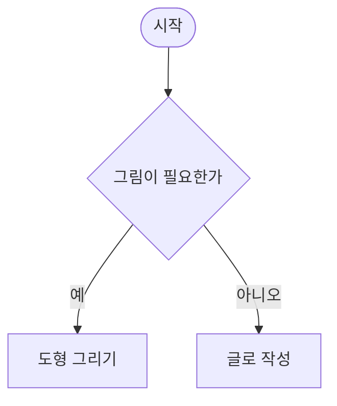

# 프로젝트 이름

위쪽 도구로 **굵게**, *기울임*, 목록, 표를 넣고 **도형 그리기**로 다이어그램을 그려 보세요.

## 진행 순서

```mermaid
flowchart TB
    A(["시작"])
    B{"그림이 필요한가"}
    C["도형 그리기"]
    D["글로 작성"]
    A --> B
    B -->|"예"| C
    B -->|"아니오"| D
%% mdpaint:eyJtb2RlIjoiZmxvdyIsImRpciI6IlRCIiwiaG9sZCI6ZmFsc2UsInNlcSI6Nywibm9kZXMiOlt7ImlkIjoibjEiLCJzaGFwZSI6InN0YWRpdW0iLCJ4IjoxNzMsInkiOjMxLCJ3Ijo4NCwiaCI6NDgsInRleHQiOiLsi5zsnpEifSx7ImlkIjoibjIiLCJzaGFwZSI6ImRpYW1vbmQiLCJ4IjoxMzYsInkiOjk2LCJ3IjoxNTgsImgiOjE1OCwidGV4dCI6Iuq3uOumvOydtCDtlYTsmpTtlZzqsIAifSx7ImlkIjoibjMiLCJzaGFwZSI6InJlY3QiLCJ4Ijo2MiwieSI6MjgxLCJ3IjoxMDYsImgiOjU0LCJ0ZXh0Ijoi64+E7ZiVIOq3uOumrOq4sCJ9LHsiaWQiOiJuNCIsInNoYXBlIjoicmVjdCIsIngiOjI2OSwieSI6MjgxLCJ3Ijo5MiwiaCI6NTQsInRleHQiOiLquIDroZwg7J6R7ISxIn1dLCJlZGdlcyI6W3siaWQiOiJlNSIsImEiOiJuMSIsImIiOiJuMiIsImtpbmQiOiJhcnJvdyIsInRleHQiOiIifSx7ImlkIjoiZTYiLCJhIjoibjIiLCJiIjoibjMiLCJraW5kIjoiYXJyb3ciLCJ0ZXh0Ijoi7JiIIn0seyJpZCI6ImU3IiwiYSI6Im4yIiwiYiI6Im40Iiwia2luZCI6ImFycm93IiwidGV4dCI6IuyVhOuLiOyYpCJ9XX0=
```

- [x] 문서 뼈대 잡기
- [ ] 다이어그램 다듬기

ㅁㄴㄹ
