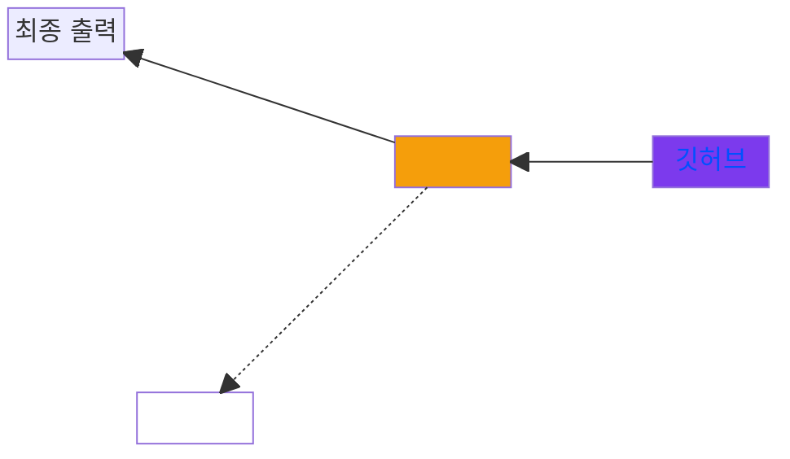

```mermaid
block-beta
    columns 6
    A["최종 출력"] space:5
    space:6
    space:3 B["<font color='#1f2328'> </font>"] space C["<font color='#0051ff'>깃허브</font>"]
    space:6
    space:6
    space:6
    space D["<font color='#92400e'> </font>"] space:4
    B --> A
    B -.-> D
    C --> B
    style B fill:#f59e0b
    style C fill:#7c3aed
    style D fill:#ffffff
```

ㅁㅁㄴㅇㄴㅁㄴ
