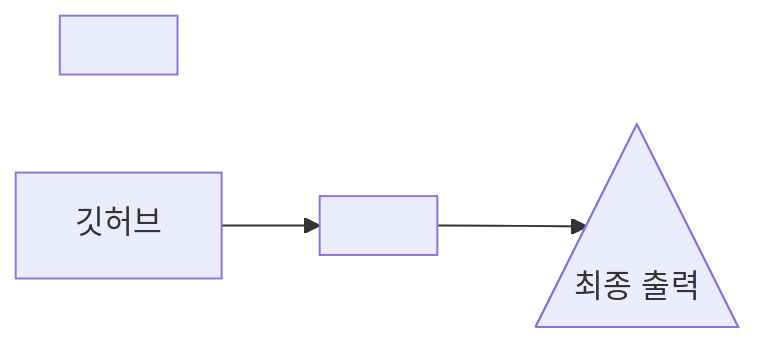

# MD Editer for Git

> > [!TIP]
> > ```
> > ㅁㄴㅇㅁㄴㅇㅁㄴㅇㅁㄴㅇ
> > ```

위쪽 도구로 **굵게**, *기울임*, 목록, 표를 넣고 **도형 그리기**로 다이어그램을 그려 보세요.

## 진행 순서



- [x] 문서 뼈대 잡기
- [x] 다이어그램 다듬기

---

---

---

---

---

> [!NOTE]
> 1234556788

> [!WARNING]
> ㅁㄴㅇㅁㄴㅇㅁㄴㄹㅇㄴㅁㅎ

> [!CAUTION]
> ㄹㅇㄶㄴㅇ로ㅓ너너너ㅓ너너너넌
