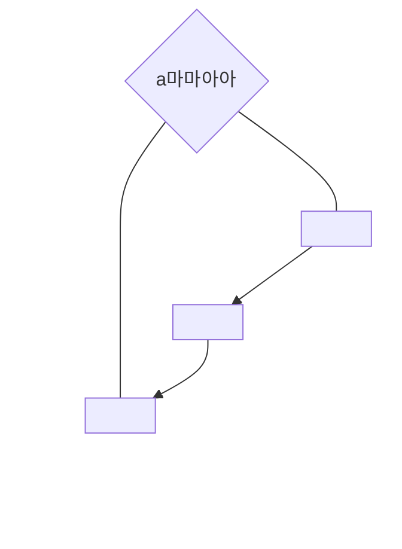

```mermaid
flowchart TB
    s1[" "]
    A{"a마마아아"}
    B[" "]
    C[" "]
    s2[" "]
    s3[" "]
    s4[" "]
    D[" "]
    s5[" "]
    s1 ~~~ C ~~~ s4
    A ~~~ s2 ~~~ D
    B ~~~ s3 ~~~ s5
    A --- B
    A --- C
    B --> D
    D --> C
    classDef ghost fill:none,stroke:none
    class s1,s2,s3,s4,s5 ghost
%% mdpaint:eyJtb2RlIjoiZmxvdyIsImRpciI6IlRCIiwiaG9sZCI6dHJ1ZSwic2VxIjo4LCJub2RlcyI6W3siaWQiOiJuMSIsInNoYXBlIjoicmVjdCIsIngiOjM2MiwieSI6NjEsInciOjcyLCJoIjo1NCwidGV4dCI6IiJ9LHsiaWQiOiJuMiIsInNoYXBlIjoicmVjdCIsIngiOjQ0LCJ5Ijo3MCwidyI6NzIsImgiOjU0LCJ0ZXh0IjoiIn0seyJpZCI6Im4zIiwic2hhcGUiOiJyZWN0IiwieCI6MjE4LCJ5IjozNzgsInciOjcyLCJoIjo1NCwidGV4dCI6IiJ9LHsiaWQiOiJuNiIsInNoYXBlIjoiZGlhbW9uZCIsIngiOjE4MCwieSI6MCwidyI6MTIwLCJoIjoxMjAsInRleHQiOiJh66eI66eI7JWE7JWEIn1dLCJlZGdlcyI6W3siaWQiOiJlNCIsImEiOiJuMSIsImIiOiJuMyIsImtpbmQiOiJhcnJvdyIsInRleHQiOiIifSx7ImlkIjoiZTUiLCJhIjoibjMiLCJiIjoibjIiLCJraW5kIjoiYXJyb3ciLCJ0ZXh0IjoiIn0seyJpZCI6ImU3IiwiYSI6Im42IiwiYiI6Im4xIiwia2luZCI6ImxpbmUiLCJ0ZXh0IjoiIn0seyJpZCI6ImU4IiwiYSI6Im42IiwiYiI6Im4yIiwia2luZCI6ImxpbmUiLCJ0ZXh0IjoiIn1dfQ==
```
