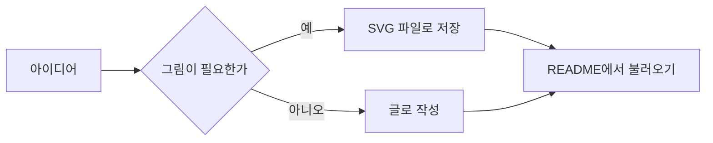
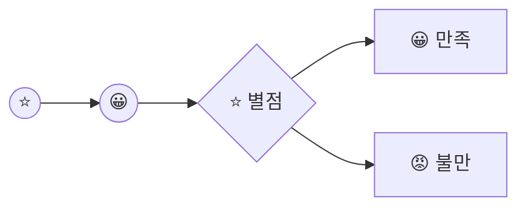
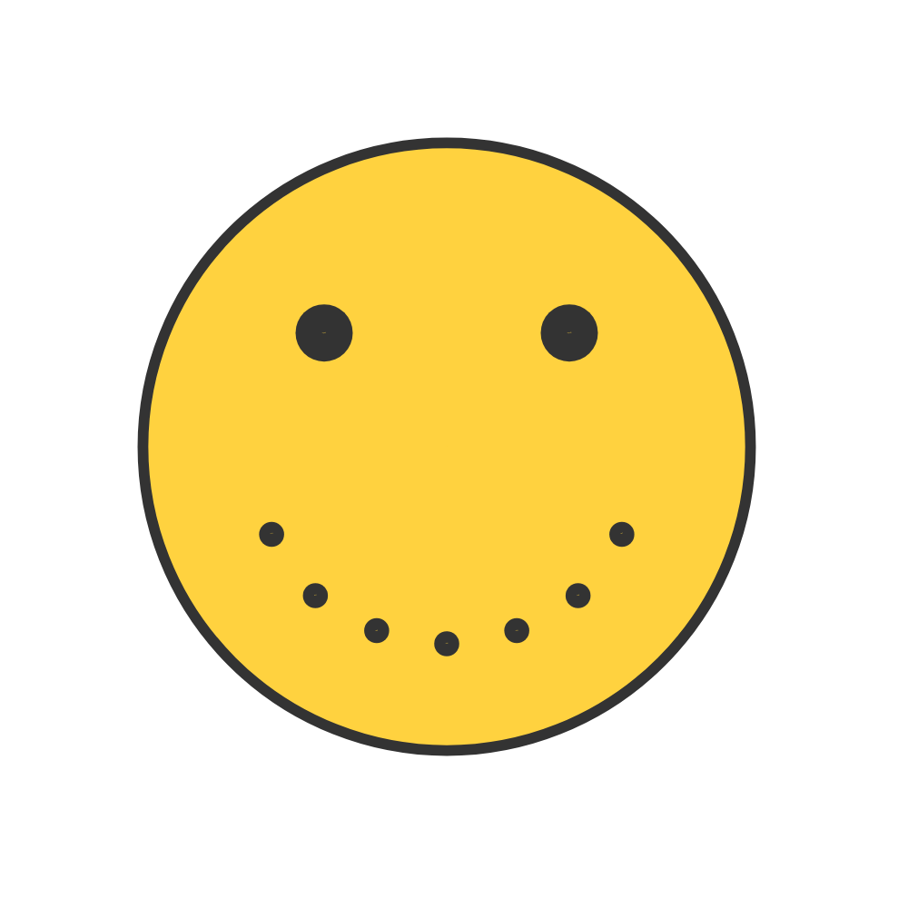

# MD Editer for Git

위쪽 도구로 **굵게**, *기울임*, 목록, 표를 넣고 **도형 그리기**로 다이어그램을 그려 보세요.

## 진행 순서


- [x] 문서 뼈대 잡기
- [x] 다이어그램 다듬기

---

---

---

---

---

> [공지사항]
> 테스트 입니다만 내용을 입력하세요


# 깃허브에서 그려지는 것들

## 머메이드 (도표)



## GeoJSON (지도 위 도형)

```geojson
{
  "type": "FeatureCollection",
  "features": [
    {
      "type": "Feature",
      "properties": { "name": "한라산" },
      "geometry": {
        "type": "Point",
        "coordinates": [126.53, 33.36]
      }
    },
    {
      "type": "Feature",
      "properties": { "name": "제주도 영역" },
      "geometry": {
        "type": "Polygon",
        "coordinates": [[
          [126.15, 33.25],
          [126.95, 33.25],
          [126.95, 33.57],
          [126.15, 33.57],
          [126.15, 33.25]
        ]]
      }
    }
  ]
}
```

## STL (3D 모델)

```stl
solid tetrahedron
  facet normal 0 0 -1
    outer loop
      vertex 0 0 0
      vertex 5 8.66 0
      vertex 10 0 0
    endloop
  endfacet
  facet normal 0 -0.943 0.334
    outer loop
      vertex 0 0 0
      vertex 10 0 0
      vertex 5 2.89 8.16
    endloop
  endfacet
  facet normal 0.816 0.471 0.333
    outer loop
      vertex 10 0 0
      vertex 5 8.66 0
      vertex 5 2.89 8.16
    endloop
  endfacet
  facet normal -0.816 0.471 0.333
    outer loop
      vertex 5 8.66 0
      vertex 0 0 0
      vertex 5 2.89 8.16
    endloop
  endfacet
endsolid tetrahedron
```








